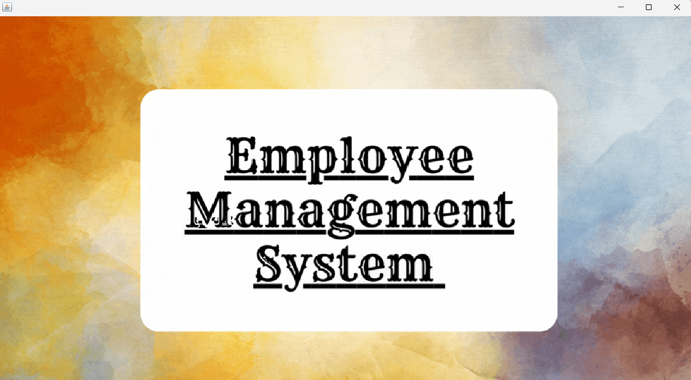
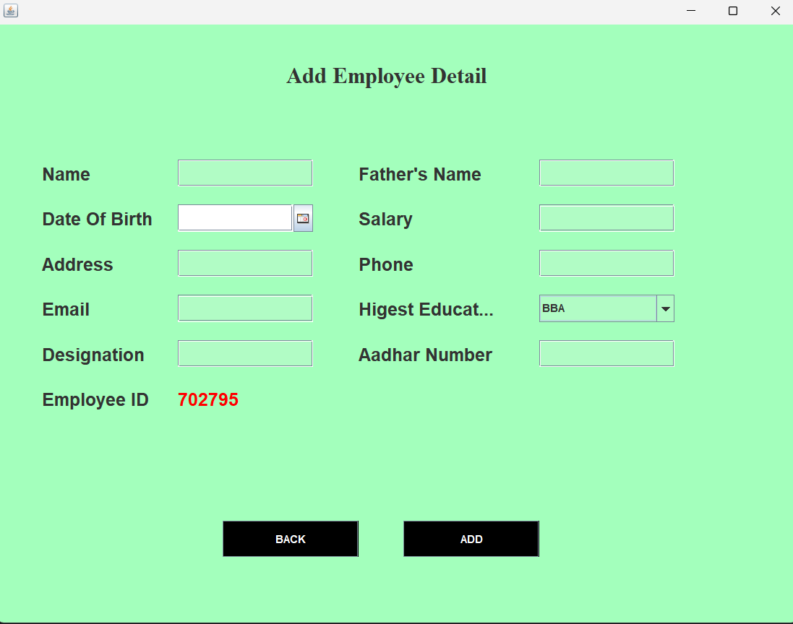

# Employee Management System

## Project Overview

**Employee Management System** is a Java-based desktop application that provides a GUI interface to manage employee records effectively. It allows administrators to perform core operations such as adding, updating, viewing, and removing employee data securely and efficiently.

---

## Features

- Login Authentication  
- Add New Employees  
- View Employee Details  
- Update Existing Employee Information  
- Remove Employees  
- Interactive GUI 

---

## Technologies Used

- Java (Swing & AWT) — For GUI development  
- JDBC (Java Database Connectivity) — For database operations  
- MySQL — As the backend database  
- IntelliJ IDEA 

---

## Project Structure

| File Name             | Description                                 |
|-----------------------|---------------------------------------------|
| `Main_class.java`     | Entry point for our project         |
| `Login.java`          | Handles user login                          |
| `Dashboard.java`      | Main application window after login         |
| `AddEmployee.java`    | Form to add a new employee                  |
| `UpdateEmployee.java` | Form to update existing employee info       |
| `RemoveEmployee.java` | Module to delete employee records           |
| `View_Employee.java`  | Displays all employee data in a table       |
| `conn.java`           | Handles database connection using JDBC      |

---

## Prerequisites

- JDK 8 or higher  
- MySQL Server  
- JDBC Driver for MySQL (`mysql-connector-java.jar`)  
- Java IDE (e.g., IntelliJ IDEA or Eclipse)

---

## How to Run

1. Clone the repository or download the source code.  
2. Set up a MySQL database and update the connection details in `conn.java`:
   ```java
   Connection c = DriverManager.getConnection("jdbc:mysql://localhost:3306/ems", "root", "password");
3. Update the login details in the database using mysql terminal or workbench
   
4. Compile and run `Main_class.java` to start the splash screen.  
5. After the splash, `Login.java` appears. Upon successful login, `Dashboard.java` (main app) is launched.

---

## Database Schema

Create a MySQL database named `ems` and an `employee` table with the following structure:

```sql
CREATE DATABASE ems;

USE ems;

CREATE TABLE employee (
    name varchar(40), 
    fname varchar(40), 
    dob varchar(40), 
    salary varchar(40), 
    address varchar(40), 
    phone varchar(40), 
    email varchar(40), 
    education varchar(40), 
    designation varchar(40), 
    aadhar varchar(40), 
    empID varchar(40) 

);
```

---

## Screenshots

**Startup Animation**


**Dashboard Window**


**Add Employee Form**



---

## Contributors

- Prem Choudhary

---

## License

This project is licensed under the MIT License.
