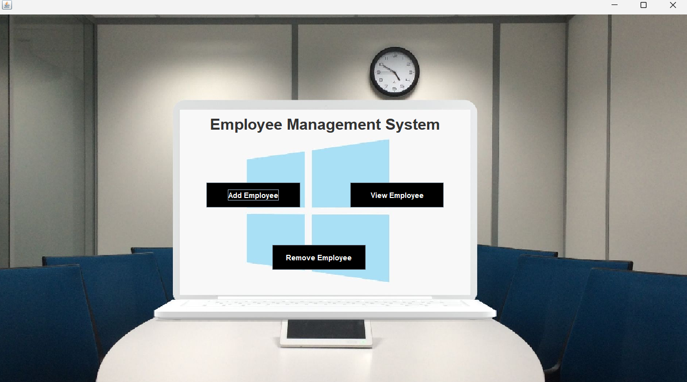

# Employee Management System

## Project Overview

**Employee Management System** is a Java-based desktop application that provides a GUI interface to manage employee records effectively. It allows administrators to perform core operations such as adding, updating, viewing, and removing employee data securely and efficiently.

---

## Features

- Login Authentication  
- Add New Employees  
- View Employee Details  
- Update Existing Employee Information  
- Remove Employees  
- Interactive GUI  

---

## Technologies Used

- Java (Swing & AWT) — For GUI development  
- JDBC (Java Database Connectivity) — For database operations  
- MySQL — As the backend database  
- IntelliJ IDEA  

---

## Project Structure

| File Name             | Description                                 |
|-----------------------|---------------------------------------------|
| `Main_class.java`     | Entry point for the project                 |
| `Login.java`          | Handles user login                          |
| `Dashboard.java`      | Main application window after login         |
| `AddEmployee.java`    | Form to add a new employee                  |
| `UpdateEmployee.java` | Form to update existing employee info       |
| `RemoveEmployee.java` | Module to delete employee records           |
| `View_Employee.java`  | Displays all employee data in a table       |
| `conn.java`           | Handles database connection using JDBC      |

---

## Prerequisites

- JDK 8 or higher  
- MySQL Server  
- JDBC Driver for MySQL (`mysql-connector-java.jar`)  
- Java IDE (e.g., IntelliJ IDEA or Eclipse)

---

## How to Run

1. Clone the repository or download the source code.  
2. Set up a MySQL database and update the connection details in `conn.java`:
   ```java
   Connection c = DriverManager.getConnection("jdbc:mysql://localhost:3306/ems", "root", "your_password");
   ```
3. Add login credentials manually to the database using MySQL terminal or Workbench.
4. Compile and run `Main_class.java` to start the splash screen.  
5. After the splash, `Login.java` appears. Upon successful login, `Dashboard.java` (main app) is launched.

---

## Database Schema

Create a MySQL database named `ems` and an `employee` table with the following structure:

```sql
CREATE DATABASE ems;

USE ems;

CREATE TABLE employee (
    name varchar(40), 
    fname varchar(40), 
    dob varchar(40), 
    salary varchar(40), 
    address varchar(40), 
    phone varchar(40), 
    email varchar(40), 
    education varchar(40), 
    designation varchar(40), 
    aadhar varchar(40), 
    empID varchar(40) 
);
```

You may also create a `login` table to enable login authentication:

```sql
CREATE TABLE login (
    username VARCHAR(40),
    password VARCHAR(40)
);

INSERT INTO login VALUES ('admin', 'admin123');
```
---

## How to Use the JAR File

If you'd like to run the app directly without compiling the source code:

### Step 1: Download the JAR File

Download the JAR from the **Releases** section of this repository or from a shared link (if available).

### Step 2: Run the JAR File

Open a terminal or command prompt where the JAR is located and run:

```bash
java -jar "employee-management-system.jar"
```

> Note: Use quotes if your JAR file name contains spaces.  
> Java must be installed and added to your system PATH.

---

## Screenshots

> Below are some key interfaces of the Employee Management System:
### Startup Animation  


### Dashboard View  


### Add Employee Page  


---

## Contributors

- Prem Choudhary

---

## License

This project is licensed under the [MIT License](LICENSE).
